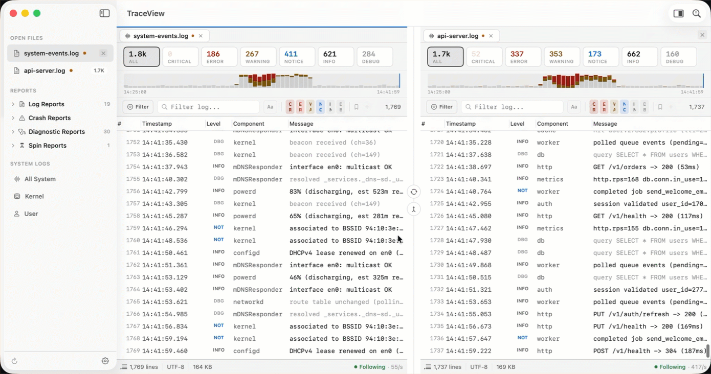
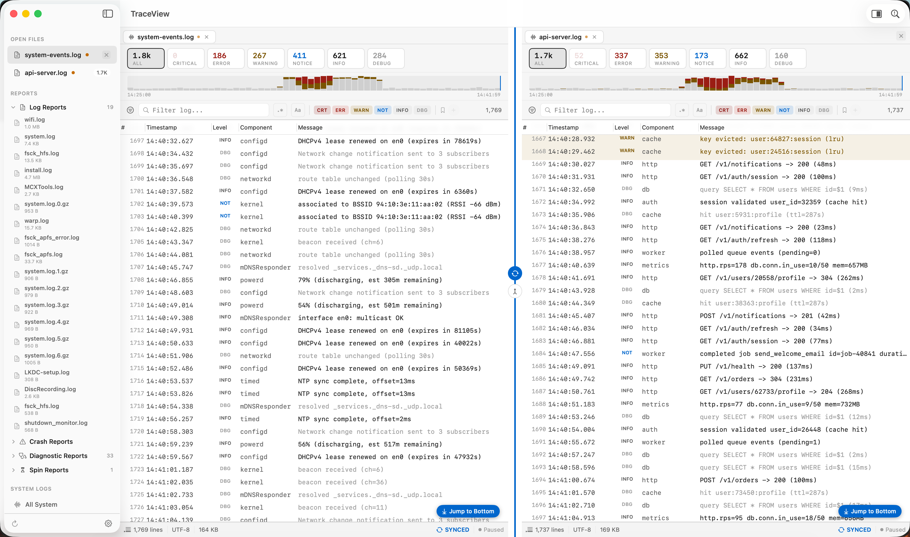
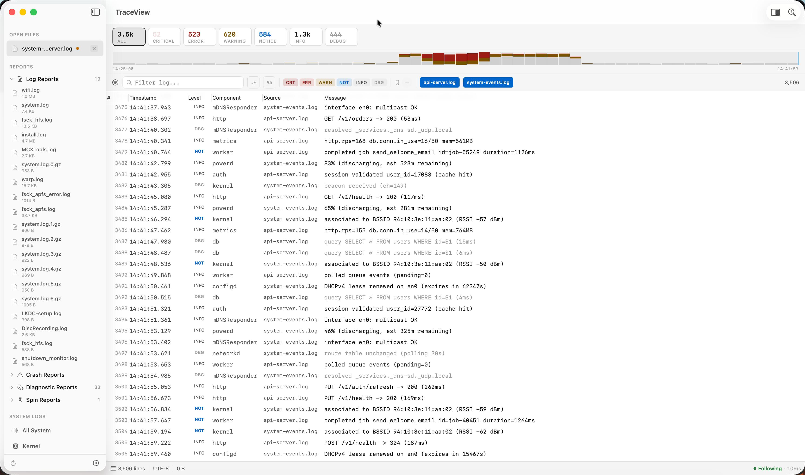
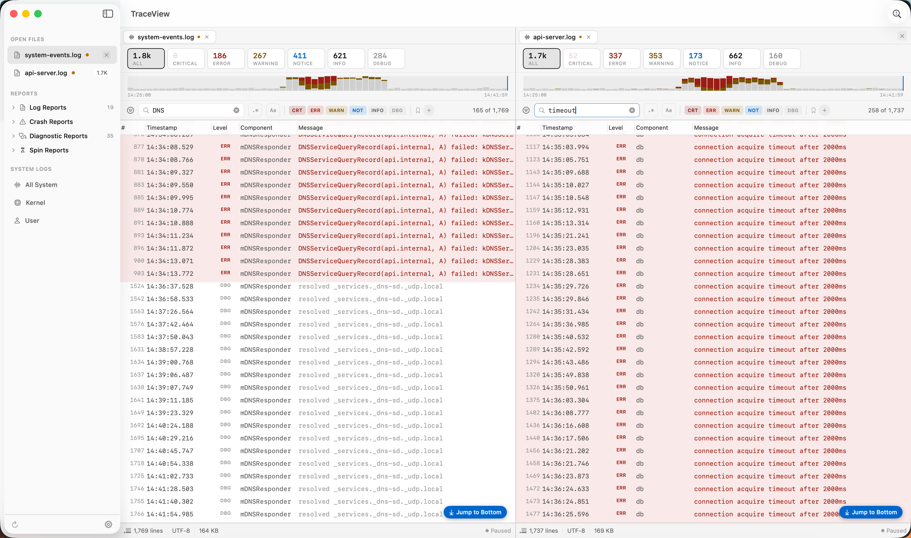
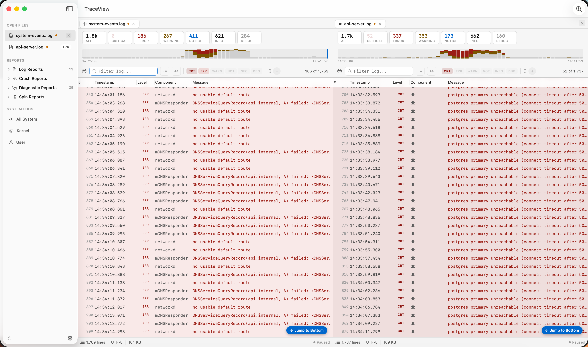
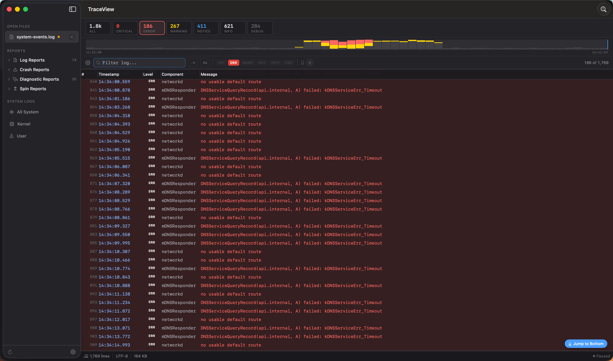
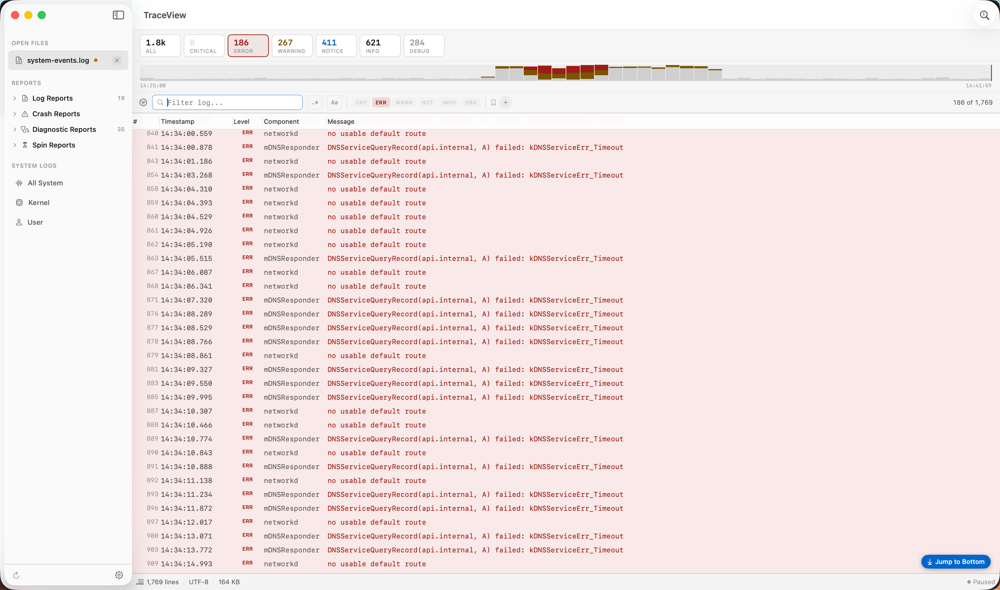

# TraceView

[](LICENSE)
[](#requirements)
[](https://buymeacoffee.com/thefinder808)

A native macOS log viewer for admins, developers, and anyone who reads too many log files. Inspired by Microsoft's CMTrace.

Real-time file following, severity-aware highlighting, built-in error-code lookup, and a Console.app-style browser for system reports — all in a SwiftUI interface that feels at home on macOS 14+.

<p align="center">
  
</p>

## Features

- **Real-time following** — new lines auto-scroll into view. Scroll up to investigate, scroll back down to resume. Kernel-level file watching (`DispatchSource`), no polling.
- **Severity highlighting** — errors get red row backgrounds, warnings get yellow, critical rows are deeper red. Detected from structured formats (`messageType`, JSON `level`, SCCM `type`) and fallback keyword heuristics for plain text.
- **Severity summary chips** — live per-level counts (`Critical 4 · Error 127 · Warning 342 · …`). Click to filter.
- **Event histogram** — 60-bucket density strip above the table, stacked error/warn bars, trailing "now" marker. **Click any bucket to jump to that moment** — the click lands on the highest-severity entry in the bucket so a click on a red spike actually opens an error. **Spike preservation** keeps live-tail histograms readable: as the time range stretches, earlier spikes leave a faint shadow at their original height instead of fading into the noise floor. Auto-hides when timestamps aren't parseable.
- **Expand-in-place drawer** — single-click any row to expand it with metadata, full message, and action pills (`Copy`, `Filter to component`, `Lookup error code`). Switchable to a bottom detail pane in Settings.
- **Error-code lookup inspector** — built-in database for `errno`, `OSStatus`, `IOReturn`, Mach `kern_return_t`, and HTTP status codes. Accepts decimal, hex, symbolic, or auto-detect input. Inline error codes in log messages are tappable.
- **Saved filter presets** — snapshot the current filter to a named pill in the filter bar. Persisted.
- **Tabs** — multiple logs open in tabs with live-stream pulse dot.
- **Split view with scroll-sync** — open two logs side by side, with optional pane scroll-sync (⇧⌘S) so scrolling one pane drives the other to the closest matching timestamp. Following state mirrors across panes when sync is on. Active pane is marked with a 2px theme-tinted top accent strip; menu shortcuts (⌘F, ⌘G, ⇧⌘G, ⌘D, ⌘⌥R) route to whichever pane has focus — set via row click, tab click, or filter-bar focus.
- **Merged log view** — combine 2+ open logs into a single timeline sorted by timestamp. Each row tagged with its source; right-click to jump back to the original log. Per-source filter chips, drop-untimestamped, live-append from any source.
- **Console-style sidebar** — browse `/var/log`, `~/Library/Logs`, `/Library/Logs`, plus `.ips` reports split into Crash / Diagnostic / Spin buckets by filename classification (same rule Console.app uses). Right-click any report to open it directly in the left or right pane.
- **Bookmarks** — ⌘D bookmarks the selected row. The sidebar's Bookmarks section aggregates across every open doc, grouped by file, so you can jump back to any marked line regardless of which tab is active. Hover any bookmark for a one-click ✕ remove.
- **Live unified log** — wraps `log stream --style ndjson` for real-time system log capture with optional predicate filtering.
- **Multiple parsers** — PlainText, UnifiedLog (`log show/stream` JSON), JSONLines (including whole-file arrays), CSV, SCCM, IPS crash reports, and `.diag` diagnostic reports. Auto-detected by scoring the first ~50 lines of each file.
- **Themes** — Console (default), Light, Dark, Neon.
- **Keyboard shortcuts** — `Cmd+O` open · `Cmd+Shift+O` open in right pane · `Cmd+F` search · `Cmd+G` / `Cmd+Shift+G` next/previous match · `Cmd+D` toggle bookmark · `Cmd+Opt+R` toggle regex matching · `Cmd+Shift+L` error lookup · `Cmd+Shift+S` toggle pane sync · `Cmd+Shift+E` export · `Cmd+K` command palette · `Cmd+T` cycle theme. Full list in [spec.md](spec.md#keyboard-shortcuts).

## Screenshots

<table>
  <tr>
    <td></td>
    <td></td>
  </tr>
  <tr>
    <td align="center"><sub>Split view with scroll-sync — both panes locked to the same timestamp</sub></td>
    <td align="center"><sub>Merged log view — two logs combined into a single sorted timeline with per-source filters</sub></td>
  </tr>
  <tr>
    <td></td>
    <td></td>
  </tr>
  <tr>
    <td align="center"><sub>Split view with independent filters per pane</sub></td>
    <td align="center"><sub>Filtered to errors — histogram shows the cluster</sub></td>
  </tr>
  <tr>
    <td></td>
    <td></td>
  </tr>
  <tr>
    <td align="center"><sub>Dark theme</sub></td>
    <td align="center"><sub>Single pane — histogram and severity chips up close</sub></td>
  </tr>
</table>

## Requirements

- macOS 14 (Sonoma) or later
- Swift 5.9 toolchain (ships with Xcode 15+)

## Build

```sh
./build.sh run       # build .app and run with stdout visible (dev loop)
./build.sh app       # build debug .app bundle → build/TraceView.app
./build.sh release   # build release .app bundle
./build.sh install   # build release and copy to /Applications
./build.sh clean     # nuke build artifacts
```

`./build.sh run` is the normal dev command. It compiles with SPM, assembles a real `.app` around the binary, ad-hoc code-signs it, and execs the binary directly so `print()` output stays in your terminal. Running inside a proper bundle matters — some AppKit/SwiftUI APIs (menu bar, UserDefaults domain, TCC prompts, window restoration) misbehave for bare binaries.

## Architecture

```
Sources/TraceView/
  App/               @main, scenes, commands, AppState, SettingsManager
  Models/            LogEntry, LogLevel, LogDocument, LogFilter, LogFilterPreset
  Parsing/           LogParser protocol + seven built-in parsers + auto-detect
  Services/          FileWatcher, UnifiedLogStream, ErrorCodeLookup,
                     LogBrowserService, ExportService
  ViewModels/        LogDocumentViewModel, ErrorLookupViewModel
  Theme/             AppTheme protocol, ThemeManager, Console/Light/Dark/Neon
  Views/
    Components/      CommandPalette, StatusBarView, LogLevelBadge
    Sidebar/         SidebarView (Open Files / Reports / System Logs)
    LogView/         NSLogTableView (AppKit-backed for perf), LogRowView,
                     FilterBarView, SeveritySummaryBar, HistogramView,
                     TabBarView, FilterPresetsView, InlineRowDetailView,
                     DetailPaneView
    ErrorLookup/     ErrorLookupPanel
    ContentView, WelcomeView, SettingsView
```

The log table is an `NSTableView` wrapped via `NSViewRepresentable` — SwiftUI's `LazyVStack` can't keep up with 100K+ line files or live-tail bursts. Everything else is pure SwiftUI.

Full design + feature spec in [spec.md](spec.md).

## Performance targets

| Scenario | Target |
|----------|--------|
| Open 100K-line file | < 2s to first render |
| Scroll 100K lines | 60 fps |
| Live tail at 100 lines/sec | Smooth, no lag |
| Filter 100K lines | < 500ms |
| Memory (100K loaded) | < 150 MB |

## Status

Phase 1 of the Console Dense redesign is shipped. Phase 2 (Clean Native / Observability / Editorial as selectable theme skins) is queued.

## License

[MIT](LICENSE) — use it, fork it, ship it. Attribution appreciated but not required.

## Support

TraceView is free and open source. If it saved you an hour of log-staring, you can [buy me a coffee](https://buymeacoffee.com/thefinder808) — zero pressure, always welcome.
