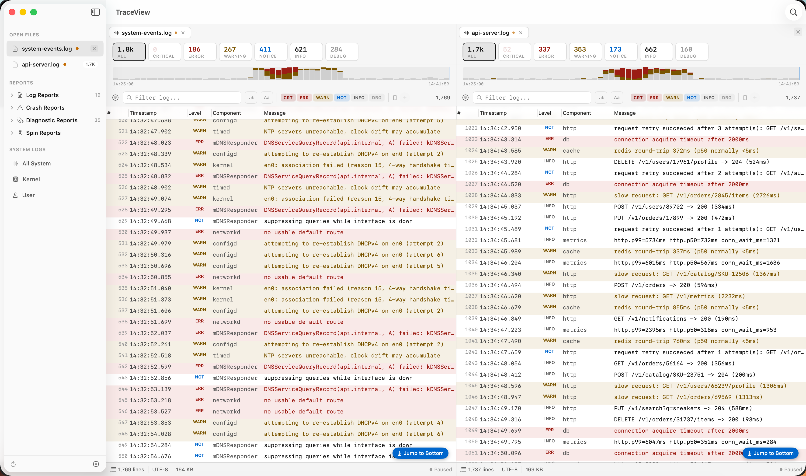

# TraceView

[](LICENSE)
[](#requirements)
[](https://buymeacoffee.com/thefinder808)

A native macOS log viewer for admins, developers, and anyone who reads too many log files. Inspired by Microsoft's CMTrace.

Real-time file following, severity-aware highlighting, built-in error-code lookup, and a Console.app-style browser for system reports — all in a SwiftUI interface that feels at home on macOS 14+.

<p align="center">
  
</p>

## Features

- **Real-time following** — new lines auto-scroll into view. Scroll up to investigate, scroll back down to resume. Kernel-level file watching (`DispatchSource`), no polling.
- **Severity highlighting** — errors get red row backgrounds, warnings get yellow, critical rows are deeper red. Detected from structured formats (`messageType`, JSON `level`, SCCM `type`) and fallback keyword heuristics for plain text.
- **Severity summary chips** — live per-level counts (`Critical 4 · Error 127 · Warning 342 · …`). Click to filter.
- **Event histogram** — 60-bucket density strip above the table, stacked error/warn bars, trailing "now" marker. Auto-hides when timestamps aren't parseable.
- **Expand-in-place drawer** — single-click any row to expand it with metadata, full message, and action pills (`Copy`, `Filter to component`, `Lookup error code`). Switchable to a bottom detail pane in Settings.
- **Error-code lookup inspector** — built-in database for `errno`, `OSStatus`, `IOReturn`, Mach `kern_return_t`, and HTTP status codes. Accepts decimal, hex, symbolic, or auto-detect input. Inline error codes in log messages are tappable.
- **Saved filter presets** — snapshot the current filter to a named pill in the filter bar. Persisted.
- **Tabs** — multiple logs open in tabs with live-stream pulse dot.
- **Console-style sidebar** — browse `/var/log`, `~/Library/Logs`, `/Library/Logs`, plus `.ips` reports split into Crash / Diagnostic / Spin buckets by filename classification (same rule Console.app uses).
- **Live unified log** — wraps `log stream --style json` for real-time system log capture with optional predicate filtering.
- **Multiple parsers** — PlainText, UnifiedLog (`log show/stream` JSON), JSONLines, CSV, SCCM. Auto-detected by scoring the first ~50 lines of each file.
- **Themes** — Console (default), Light, Dark, Neon.
- **Keyboard shortcuts** — `Cmd+O` open · `Cmd+F` search · `Cmd+E` next error · `Cmd+Shift+L` error lookup · `Cmd+K` command palette · `Cmd+T` cycle theme. Full list in [spec.md](spec.md#keyboard-shortcuts).

## Requirements

- macOS 14 (Sonoma) or later
- Swift 5.9 toolchain (ships with Xcode 15+)

## Build

```sh
./build.sh run       # build .app and run with stdout visible (dev loop)
./build.sh app       # build debug .app bundle → build/TraceView.app
./build.sh release   # build release .app bundle
./build.sh install   # build release and copy to /Applications
./build.sh clean     # nuke build artifacts
```

`./build.sh run` is the normal dev command. It compiles with SPM, assembles a real `.app` around the binary, ad-hoc code-signs it, and execs the binary directly so `print()` output stays in your terminal. Running inside a proper bundle matters — some AppKit/SwiftUI APIs (menu bar, UserDefaults domain, TCC prompts, window restoration) misbehave for bare binaries.

## Architecture

```
Sources/TraceView/
  App/               @main, scenes, commands, AppState, SettingsManager
  Models/            LogEntry, LogLevel, LogDocument, LogFilter, LogFilterPreset
  Parsing/           LogParser protocol + five built-in parsers + auto-detect
  Services/          FileWatcher, UnifiedLogStream, ErrorCodeLookup,
                     LogBrowserService, ExportService
  ViewModels/        LogDocumentViewModel, ErrorLookupViewModel
  Theme/             AppTheme protocol, ThemeManager, Console/Light/Dark/Neon
  Views/
    Components/      CommandPalette, StatusBarView, LogLevelBadge
    Sidebar/         SidebarView (Open Files / Reports / System Logs)
    LogView/         NSLogTableView (AppKit-backed for perf), LogRowView,
                     FilterBarView, SeveritySummaryBar, HistogramView,
                     TabBarView, FilterPresetsView, InlineRowDetailView,
                     DetailPaneView
    ErrorLookup/     ErrorLookupPanel
    ContentView, WelcomeView, SettingsView
```

The log table is an `NSTableView` wrapped via `NSViewRepresentable` — SwiftUI's `LazyVStack` can't keep up with 100K+ line files or live-tail bursts. Everything else is pure SwiftUI.

Full design + feature spec in [spec.md](spec.md).

## Performance targets

| Scenario | Target |
|----------|--------|
| Open 100K-line file | < 2s to first render |
| Scroll 100K lines | 60 fps |
| Live tail at 100 lines/sec | Smooth, no lag |
| Filter 100K lines | < 500ms |
| Memory (100K loaded) | < 150 MB |

## Status

Phase 1 of the Console Dense redesign is shipped. Phase 2 (Clean Native / Observability / Editorial as selectable theme skins) is queued.

## License

[MIT](LICENSE) — use it, fork it, ship it. Attribution appreciated but not required.

## Support

TraceView is free and open source. If it saved you an hour of log-staring, you can [buy me a coffee](https://buymeacoffee.com/thefinder808) — zero pressure, always welcome.
